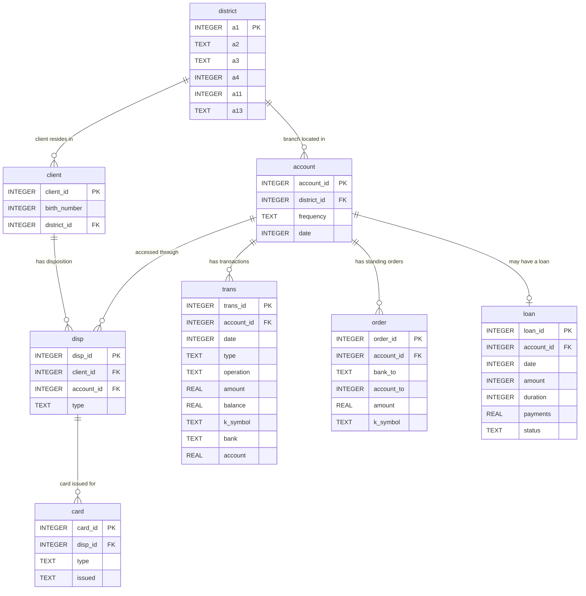

# Database schema — Berka

The app queries the [Berka dataset](https://sorry.vse.cz/~berka/challenge/pkdd1999/berka.htm)
(PKDD'99), a real anonymised Czech bank. It has 8 related tables. Money amounts
are in Czech koruna, and dates are stored as integers in `YYMMDD` format.

## Entity-relationship diagram

> The `district` entity above shows only its key and most-used columns to keep the
> diagram legible; the full list of `a1`–`a16` is decoded in the data dictionary below.

**How to read the relationships:** a client and an account are not linked directly —
they meet in the `disp` (disposition) table, which records a client's right to
operate an account. So the common path is `client → disp → account`, and from an
account you reach its `trans`, `order`, `loan`, and (via `disp`) its `card`.

## Data dictionary

### account — one row per bank account (4,500 rows)
| Field | Type | Key | Description |
|-------|------|-----|-------------|
| account_id | INTEGER | PK | Unique account identifier. |
| district_id | INTEGER | FK → district.a1 | District of the branch holding the account. |
| frequency | TEXT | | Statement frequency: `POPLATEK MESICNE` = monthly, `POPLATEK TYDNE` = weekly, `POPLATEK PO OBRATU` = after each transaction. |
| date | INTEGER | | Date the account was opened (`YYMMDD`). |

### client — one row per client (5,369 rows)
| Field | Type | Key | Description |
|-------|------|-----|-------------|
| client_id | INTEGER | PK | Unique client identifier. |
| birth_number | INTEGER | | Encodes date of birth and sex (`YYMMDD`; for women, 50 is added to the month). |
| district_id | INTEGER | FK → district.a1 | District where the client lives. |

### disp — disposition: links a client to an account (5,369 rows)
| Field | Type | Key | Description |
|-------|------|-----|-------------|
| disp_id | INTEGER | PK | Unique disposition identifier. |
| client_id | INTEGER | FK → client.client_id | The client. |
| account_id | INTEGER | FK → account.account_id | The account. |
| type | TEXT | | `OWNER` or `DISPONENT`. Only an `OWNER` can request a loan or set up a permanent order. |

### card — credit cards (892 rows)
| Field | Type | Key | Description |
|-------|------|-----|-------------|
| card_id | INTEGER | PK | Unique card identifier. |
| disp_id | INTEGER | FK → disp.disp_id | The disposition (client–account link) the card belongs to. |
| type | TEXT | | Card tier: `junior`, `classic`, or `gold`. |
| issued | TEXT | | Date the card was issued. |

### loan — at most one loan per account (682 rows)
| Field | Type | Key | Description |
|-------|------|-----|-------------|
| loan_id | INTEGER | PK | Unique loan identifier. |
| account_id | INTEGER | FK → account.account_id | Account the loan was granted to. |
| date | INTEGER | | Date the loan was granted (`YYMMDD`). |
| amount | INTEGER | | Total loan amount. |
| duration | INTEGER | | Loan term, in months. |
| payments | REAL | | Monthly payment. |
| status | TEXT | | Repayment status: `A` = finished, paid in full; `B` = finished, defaulted (not paid); `C` = running, on track; `D` = running, client in debt. |

### order — permanent (standing) payment orders (6,471 rows)
| Field | Type | Key | Description |
|-------|------|-----|-------------|
| order_id | INTEGER | PK | Unique permanent-order identifier. |
| account_id | INTEGER | FK → account.account_id | Account issuing the standing order. |
| bank_to | TEXT | | Recipient's bank (two-letter code). |
| account_to | INTEGER | | Recipient's account number. |
| amount | REAL | | Amount debited per order. |
| k_symbol | TEXT | | Purpose: `POJISTNE` = insurance, `SIPO` = household, `LEASING` = leasing, `UVER` = loan payment. |

### trans — transactions (1,056,320 rows; capped to 100,000 in the built database)
| Field | Type | Key | Description |
|-------|------|-----|-------------|
| trans_id | INTEGER | PK | Unique transaction identifier. |
| account_id | INTEGER | FK → account.account_id | Account the transaction belongs to. |
| date | INTEGER | | Transaction date (`YYMMDD`). |
| type | TEXT | | Direction: `PRIJEM` = credit, `VYDAJ` = withdrawal. |
| operation | TEXT | | Mode: `VKLAD` = cash deposit, `VYBER` = cash withdrawal, `VYBER KARTOU` = card withdrawal, `PREVOD Z UCTU` = collection from another bank, `PREVOD NA UCET` = remittance to another bank. |
| amount | REAL | | Transaction amount. |
| balance | REAL | | Account balance after the transaction. |
| k_symbol | TEXT | | Purpose: `POJISTNE` = insurance, `SLUZBY` = statement fee, `UROK` = interest credited, `SANKC. UROK` = sanction interest, `SIPO` = household, `DUCHOD` = pension, `UVER` = loan payment. |
| bank | TEXT | | Partner's bank (two-letter code). |
| account | REAL | | Partner's account number. |

### district — demographic data, one row per district (77 rows)
| Field | Type | Key | Description |
|-------|------|-----|-------------|
| a1 | INTEGER | PK | District identifier (referenced by `account.district_id` and `client.district_id`). |
| a2 | TEXT | | District name. |
| a3 | TEXT | | Region. |
| a4 | INTEGER | | Number of inhabitants. |
| a5 | INTEGER | | Municipalities with < 500 inhabitants. |
| a6 | INTEGER | | Municipalities with 500–1,999 inhabitants. |
| a7 | INTEGER | | Municipalities with 2,000–9,999 inhabitants. |
| a8 | INTEGER | | Municipalities with > 10,000 inhabitants. |
| a9 | INTEGER | | Number of cities. |
| a10 | REAL | | Ratio of urban inhabitants (%). |
| a11 | INTEGER | | Average salary. |
| a12 | TEXT | | Unemployment rate, 1995. Stored as text because a few districts have a missing (`?`) value. |
| a13 | REAL | | Unemployment rate, 1996. |
| a14 | INTEGER | | Entrepreneurs per 1,000 inhabitants. |
| a15 | TEXT | | Crimes committed in 1995. Text for the same missing-value reason as `a12`. |
| a16 | INTEGER | | Crimes committed in 1996. |

> **Data-quality note:** `a12` and `a15` come through as `TEXT` rather than numbers
> because a small number of districts have a missing `?` value in those columns. Cast
> them in SQL (e.g. `CAST(a13 AS REAL)`) if you need to compute on the 1995 figures.
